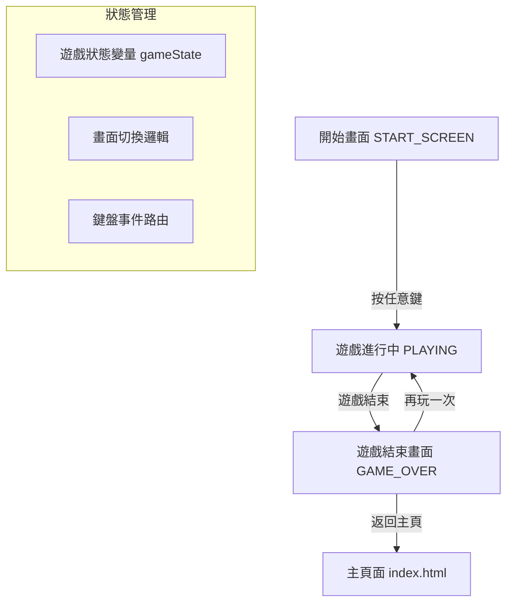

# 貪食蛇遊戲增強 - 最終計劃總結

## 項目概述
為現有的貪食蛇遊戲（`snake.html`）添加開始畫面、遊戲結束畫面和增強計分系統。

## 用戶需求滿足情況

### ✅ 已規劃實現的功能：

1. **開始畫面**
   - 顯示遊戲名稱「貪食蛇」
   - 顯示遊戲說明和操作指南
   - 「按任意鍵開始」提示文字
   - 閃爍動畫效果吸引注意力
   - 響應任意按鍵開始遊戲

2. **遊戲結束畫面**
   - 顯示「💀 Game Over」標題
   - 顯示本次分數、最高分數和蛇的長度
   - 「再玩一次」按鈕（點擊或按空格鍵/Enter鍵）
   - 「返回主頁」連結
   - 美觀的視覺設計和動畫效果

3. **計分系統增強**
   - 左上角顯示實時分數（已存在，樣式增強）
   - 每次吃到食物加10分（已存在）
   - 最高分記錄在 localStorage 中（已存在）
   - 改進分數顯示樣式和位置

## 技術實現方案

### 架構設計

### 文件修改
**主要修改文件：** `snake.html`

**修改內容：**
1. **HTML 結構** - 添加兩個覆蓋層元素
2. **CSS 樣式** - 添加覆蓋層樣式、動畫效果、響應式設計
3. **JavaScript 邏輯** - 添加狀態管理、畫面切換、事件處理

### 具體實現步驟
1. 添加開始畫面 HTML 和 CSS
2. 添加遊戲結束畫面 HTML 和 CSS  
3. 實現遊戲狀態管理（START_SCREEN, PLAYING, GAME_OVER）
4. 修改鍵盤事件處理邏輯
5. 整合現有遊戲邏輯
6. 測試和調試

## 視覺設計規範

### 顏色方案
- **主色調**：深藍背景 (#071129)
- **強調色**：綠色 (#4CAF50) - 用於分數和成功狀態
- **警告色**：紅色 (#f44336) - 用於 Game Over
- **輔助色**：紫色 (#7c3aed) - 用於提示和動畫

### 動畫效果
1. **閃爍動畫** - 「按任意鍵開始」提示
2. **淡入淡出** - 畫面切換過渡
3. **懸停效果** - 按鈕互動反饋
4. **分數更新動畫** - 分數增加時的視覺反饋

### 響應式設計
- 桌面端：完整功能，美觀佈局
- 移動端：適應小屏幕，觸控友好按鈕
- 平板端：中間尺寸優化

## 測試計劃

### 功能測試
- [ ] 開始畫面正確顯示
- [ ] 按任意鍵開始遊戲
- [ ] 遊戲控制正常（方向鍵/WASD）
- [ ] 計分系統工作（每次+10分）
- [ ] 遊戲結束條件觸發
- [ ] Game Over 畫面顯示正確信息
- [ ] 「再玩一次」按鈕功能
- [ ] 鍵盤快捷鍵（空格/Enter）功能
- [ ] 返回主頁連結工作

### 兼容性測試
- [ ] Chrome 瀏覽器
- [ ] Firefox 瀏覽器
- [ ] Safari 瀏覽器
- [ ] 移動端 Chrome
- [ ] 移動端 Safari

### 性能測試
- [ ] 畫面切換流暢
- [ ] 動畫性能良好
- [ ] 無內存洩漏
- [ ] 加載時間合理

## 風險評估和緩解措施

### 風險 1：與現有代碼衝突
- **風險**：修改可能破壞現有遊戲功能
- **緩解**：創建備份文件，逐步測試每個修改

### 風險 2：瀏覽器兼容性問題
- **風險**：某些 CSS 特性在舊瀏覽器不支持
- **緩解**：使用廣泛支持的 CSS 特性，添加降級方案

### 風險 3：移動端體驗不佳
- **風險**：觸控目標太小，佈局混亂
- **緩解**：響應式設計測試，確保觸控友好

### 風險 4：性能問題
- **風險**：過多動畫影響遊戲性能
- **緩解**：使用 CSS 硬體加速，優化渲染

## 交付物

### 主要交付物
1. 修改後的 `snake.html` 文件
2. 備份文件 `snake_backup.html`
3. 設計文檔（本文件）
4. 實現指南文檔

### 文檔交付物
1. `plan.md` - 整體設計計劃
2. `implementation_guide.md` - 具體實現指南
3. `final_plan_summary.md` - 最終計劃總結（本文件）

## 下一步行動

### 立即行動（需要用戶確認）
1. ✅ 用戶確認遊戲名稱使用「貪食蛇」
2. ✅ 用戶確認修改 `snake.html` 文件
3. ✅ 用戶確認使用默認設計方案
4. ⏳ **等待用戶確認計劃並批准實施**

### 實施階段（批准後）
1. 創建文件備份
2. 按照實現指南逐步修改
3. 測試每個功能模塊
4. 整體集成測試
5. 最終驗收測試

## 問題和澄清

### 已澄清的問題
1. ✅ 遊戲名稱：使用「貪食蛇」
2. ✅ 修改文件：`snake.html`
3. ✅ 設計方案：使用默認設計（閃爍文字、任意鍵開始）

### 待確認事項
無 - 所有需求已明確

## 時間估計
- **規劃階段**：已完成（當前階段）
- **實施階段**：約 2-3 小時
- **測試階段**：約 1 小時
- **總計**：約 3-4 小時

## 成功標準
1. 用戶打開遊戲看到開始畫面
2. 按任意鍵順利開始遊戲
3. 遊戲過程中分數正確顯示和更新
4. 遊戲結束時顯示美觀的 Game Over 畫面
5. 可以通過按鈕或鍵盤重新開始遊戲
6. 所有功能在桌面和移動端正常工作

---

## 請求用戶確認

**請確認以下事項：**

1. ✅ 遊戲名稱使用「貪食蛇」
2. ✅ 修改 `snake.html` 文件
3. ✅ 使用提供的默認設計方案
4. ⏳ **批准實施此計劃**

**如果同意，請切換到 Code 模式開始實施。**
**如果有修改意見，請提出具體建議。**